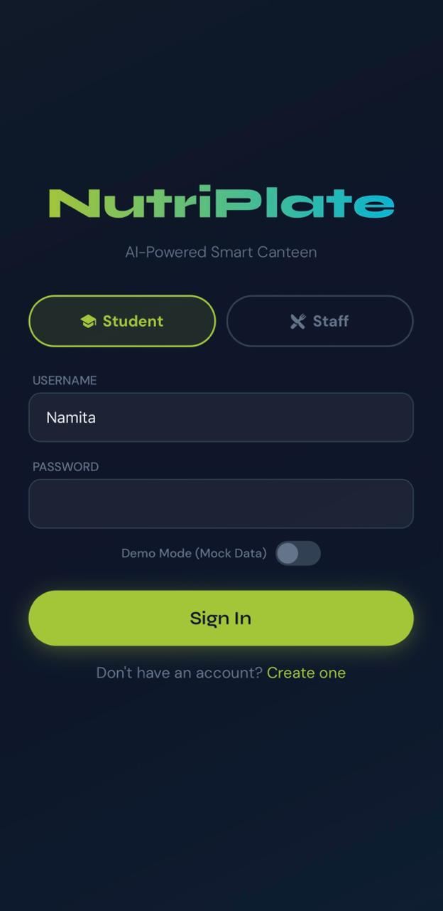
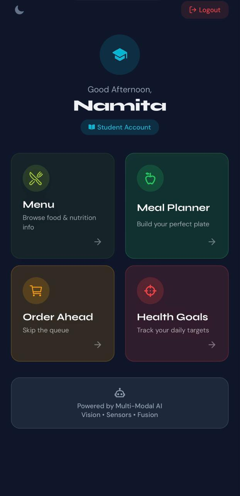
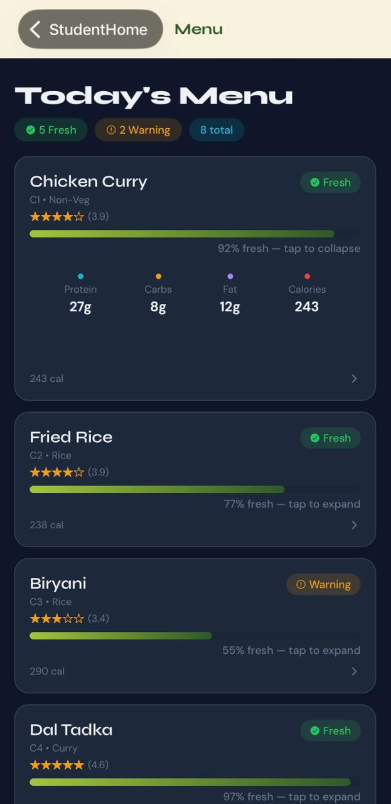
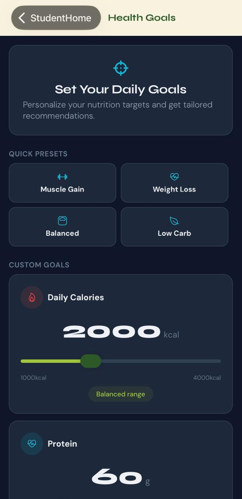
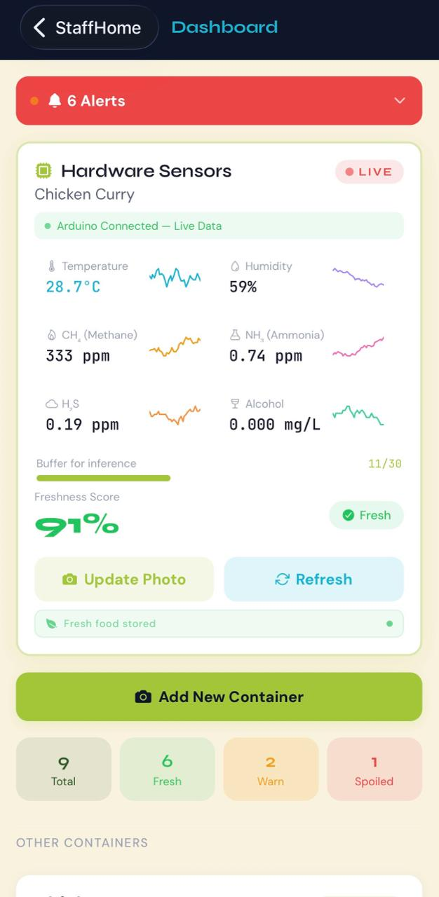
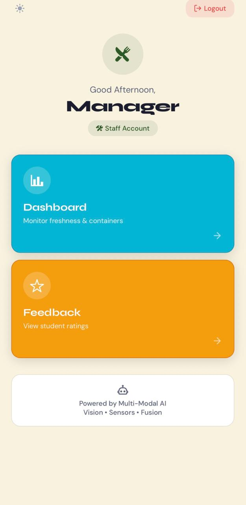
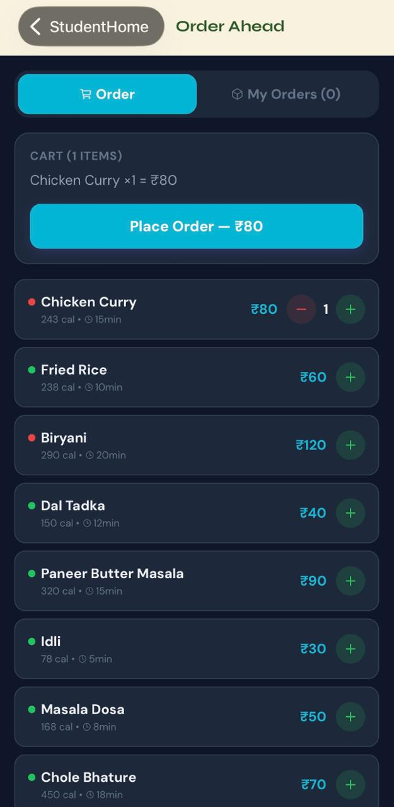
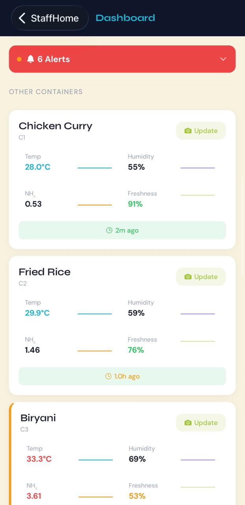
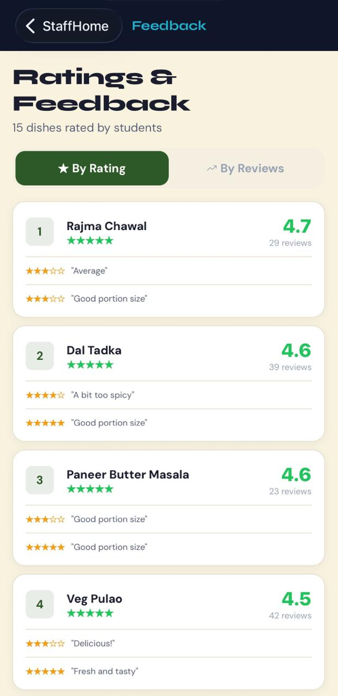

# NutriPlate — Intelligent Canteen Ecosystem

## Overview

NutriPlate is a multi-modal AI system that brings intelligence, safety, and personalization to canteen dining. It combines **computer vision**, **sensor-based analysis**, and **recommendation logic** to help users make informed food choices while enabling staff to monitor food freshness in real time.

## Key Features

- Food recognition from images  
- Nutritional analysis (calories, protein, fats, etc.)  
- Early spoilage detection using vision + sensor fusion  
- Personalized meal recommendations  
- Real-time staff dashboard for container monitoring  

## Tech Stack

### Deep Learning
- TensorFlow / Keras  
- ONNX (model deployment)  

### Backend
- FastAPI  
- SQLite  

### Frontend
- React Native (Expo)  

### Hardware
- Arduino + MQ sensors (MQ-3, MQ-4, MQ-135, MQ-136)  
- DHT11 (temperature & humidity)  

## Models Used

### 1. Food Recognition
- **Model:** InceptionV3 (Transfer Learning)  
- **Dataset:** Food-101 (101 classes)  
- **Output:** Food label used to fetch nutritional data  

### 2. Vision Spoilage Detection
- **Model:** EfficientNet-B0  
- **Output:** Spoilage probability + feature vector  

### 3. Sensor-Based Detection
- **Model:** BiLSTM  
- **Input:** Time-series sensor data (gas + environmental readings)  
- **Purpose:** Detect early spoilage patterns  

### 4. Multimodal Fusion
- **Model:** MLP  
- **Input:** Vision + sensor features  
- **Output:** Final freshness score  

## Recommendation Engine

A heuristic scoring system that suggests meals based on:
- Remaining calorie budget  
- Protein needs (highest priority)  
- Fat and portion balance  

## System Flow

1. Capture food image + sensor data  
2. Classify food (InceptionV3)  
3. Detect spoilage (EfficientNet + BiLSTM)  
4. Fuse results (MLP)  
5. Map nutrition + generate recommendations  
6. Display results to student (app) and staff (dashboard)  

# Peek into the project
<table>
  <tr>
    <td></td>
    <td></td>
    <td></td>
  </tr>
  <tr>
    <td></td>
    <td></td>
    <td></td>
  </tr>
  <tr>
    <td></td>
    <td></td>
    <td></td>
  </tr>
</table>
